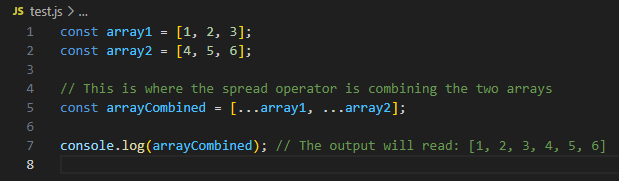
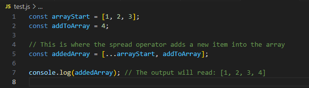
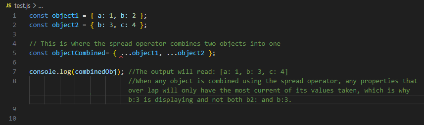

# Read 03 Passing Functions as Props

## React Docs - lists and keys

1. What does .map() return?

    •It returns a collection of objects that contains the results of a provided function to each element of the original collection.

2. If I want to loop through an array and display each value in JSX, how do I do that in React?

    •You can use the map() function to loop through an array and display each value in JSX in React.

3. Each list item needs a unique ____.

    •String or number that identified that item among its siblings.

4. What is the purpose of a key?

    •A key in React is to help manage and identify a specific element in a list of elements.

## The Spread Operator

1. What is the spread operator?

    •The spread operator in React is used to copy the elements and properties of a object or an array into another.

2. List 4 things that the spread operator can do.

    •Copy props

    •Merge arrays

    •Update state

    •Clone objects and arrays

3. Give an example of using the spread operator to combine two arrays.

    

4. Give an example of using the spread operator to add a new item to an array.

    

5. Give an example of using the spread operator to combine two objects into one.

    

## Things I want to know more about

    •Spread operators seem to have a lot of different and useful purposes. I would like to go more in depths about them and see how I can use them to my advantage.

## Resources

    •I used ChatGPT and all the reading resources for this assignment.
