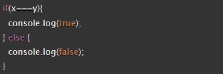
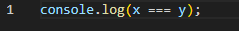

# Read 04 React and Forms

## How to use Forms in React

1. What is a ‘Controlled Component’?

    •A controlled component is a input element that is controlled by the state of a React component. They manage the form elements.

2. Should we wait to store the users responses from the form into state when they submit the form OR should we update the state with their responses as soon as they enter them? Why.

    •You can choose either option. If you wait to store the users responses that are controlled by the state of a React component, you can perform simplified validation allowing for a way to simplify the logic and reduce multiple re-renderings. If we update the state with their responses as soon as they enter it, the individual can receive real time feedback and faster validation.

3. How do we target what the user is entering if we have an event handler on an input field?

    •You can target what the user is entering by using an event handler. You access the event object which retrieves the property value.

## The Conditional (Ternary) Operator Explained

1. Why would we use a ternary operator?

    •A ternary operator is great to use when wanting to make simple decisions in programming. It is short and simple code that allows for quick decisions.

2. Rewrite the following statement using a ternary statement:

     

* Below is the simplified code using a ternary statement:

    

## Things I want to know more about

I would like to know more about how to properly make forms in React.

## Resources

I used all the reading material and ChatGPT for this assignment.
