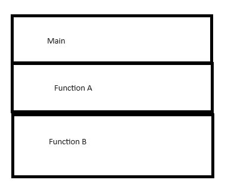

# Read 10 In memory storage

## Understanding the JavaScript Call Stack

1. What is a ‘call’?

    •It is a synchronous function call. A program requests a specific function or method to be executed.

2. How many ‘calls’ can happen at once?

    •It depends on the resources that are available. One during single-threaded programming or multiple during multi-threaded programming.

3. What does LIFO mean?

    •LIFO stands for Last In, First Out. It is a data structure principle in which to temporarily store and manage function invocation.

4. Draw an example of a call stack and the functions that would need to be invoked to generate that call stack.

    • 	 

    This is a simple drawing that shows a stack which is divided into several segments. These segments each represent a different function call. The order of the functions show LIFO.

5. What causes a Stack Overflow?

    •This occurs when there is a recursive function without an exit point.

## JavaScript error messages

1. What is a ‘reference error’?

    •You get a reference error when you try to use a variable that is not yet declared

2. What is a ‘syntax error’?

    •A syntax error occurs when you have something that cannot be parsed in terms of syntax.

3. What is a ‘range error’?

    •A range error occurs when you try to manipulate an object with some kind of length and give it an invalid length.

4. What is a ‘type error’?

    •A type error occurs when the types you are trying to use are incompatible.

5. What is a breakpoint?

    •A breakpoint is a debugging tool that allows the developer to temporarily halt the execution of a program at a specific point. This is done by putting a debugger statement in your code.

6. What does the word ‘debugger’ do in your code?

    •When using debugger in your code, it allows you to set break points at specific code lines and lets you examine the state of the code to that point.

## Things I want to know more about

I would like to know more about using useful tools and code to help me trouble shoot and debug my code.

## Resources

I used all the reading material as well as ChatGPT for this assignment. 
